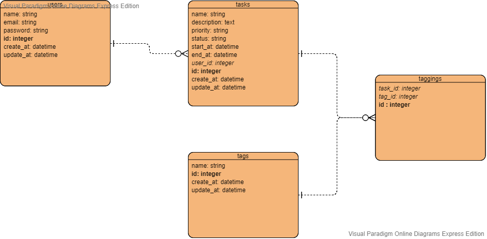

## User model
| 欄位 | 類別型態 |
| :------: | :------: | 
| id       | integer    |
| name     | string     |
| email    | string     |
| password | string     |
| create_at| datetime   |
| update_at| datetime   |

## Task model
| 欄位 | 類別型態 |
| :------: | :------: | 
| id       | integer    |
| name     | string     |
| description| string   |
| priority | string     |
| status   | string     |
| start_at | datetime   |
| end_at   | datetime   |
| create_at| datetime   |
| update_at| datetime   |
| user_id  | integer    |

## Tag model
| 欄位 | 類別型態 |
| :------: | :------: | 
| id       | integer    |
| name     | string     |
| create_at| datetime   |
| update_at| datetime   |

## Tagging model
| 欄位 | 類別型態 |
| :------: | :------: | 
| id       | integer  |
| task_id  | integer  |
| tag_id   | integer  |
